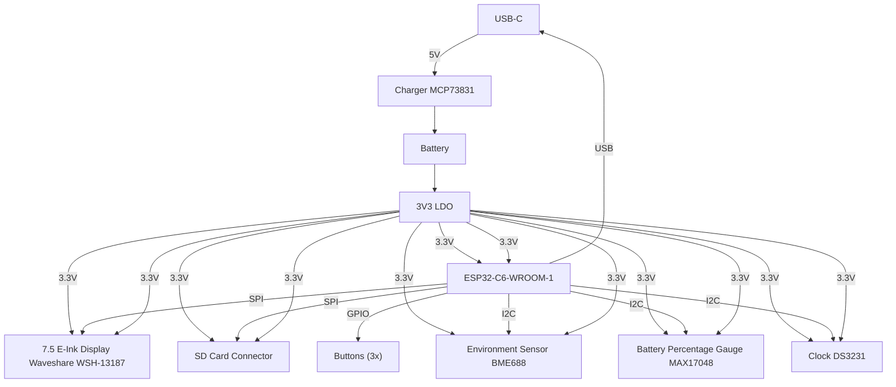

# Proiect TSC 2025 - OpenBook

## 1. Diagrama bloc a device-ului

```mermaid
flowchart TB
  USB-C -->|5V| Charger["Charger MCP73831"]
  Charger -->LiPo["Battery"]
  LiPo --> LDO["3V3 LDO"]
  
  ESP32["ESP32-C6-WROOM-1"]
  
  LDO -->|3.3V| ESP32
  LDO -->|3.3V| Display
  LDO -->|3.3V| SDCard
  LDO -->|3.3V| RTC
  LDO -->|3.3V| BME688
  LDO -->|3.3V| BatteryGauge
  
  ESP32 -- SPI --> Display["7.5 E-Ink Display Waveshare WSH-13187"]
  ESP32 -- SPI --> SDCard["SD Card Connector"]
  ESP32 -- GPIO --> Buttons["Buttons (3x)"]
  ESP32 -- I2C --> BME688["Environment Sensor BME688"]
  ESP32 -- I2C --> BatteryGauge["Battery Percentage Gauge MAX17048"]
  ESP32 -- I2C --> RTC["Clock DS3231"]
  ESP32 -- USB --> USB-C
  
  LDO -->|3.3V| ESP32
  LDO -->|3.3V| Display
  LDO -->|3.3V| SDCard
  LDO -->|3.3V| RTC
  LDO -->|3.3V| BME688
  LDO -->|3.3V| BatteryGauge
```